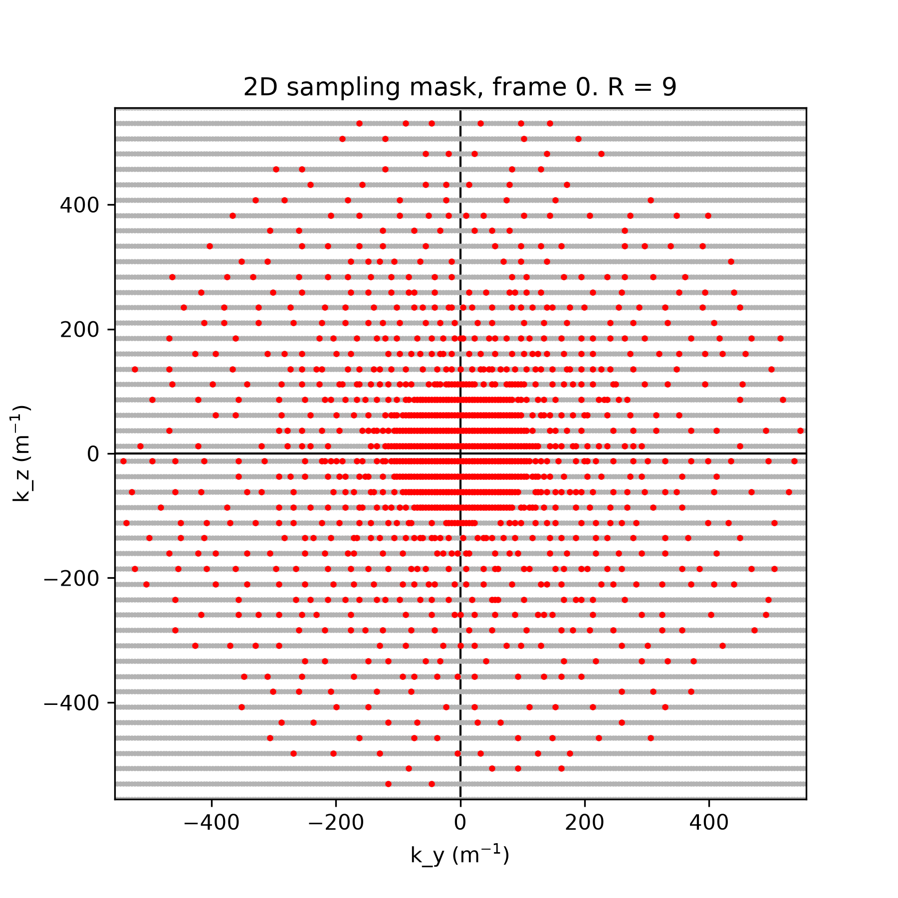
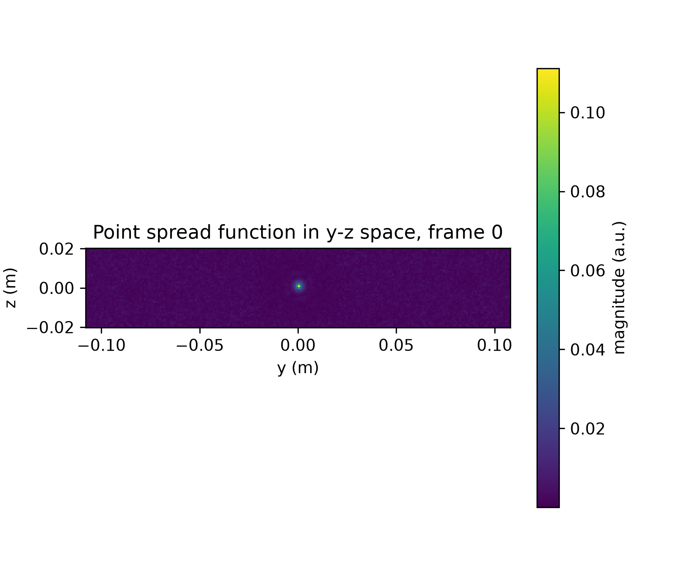
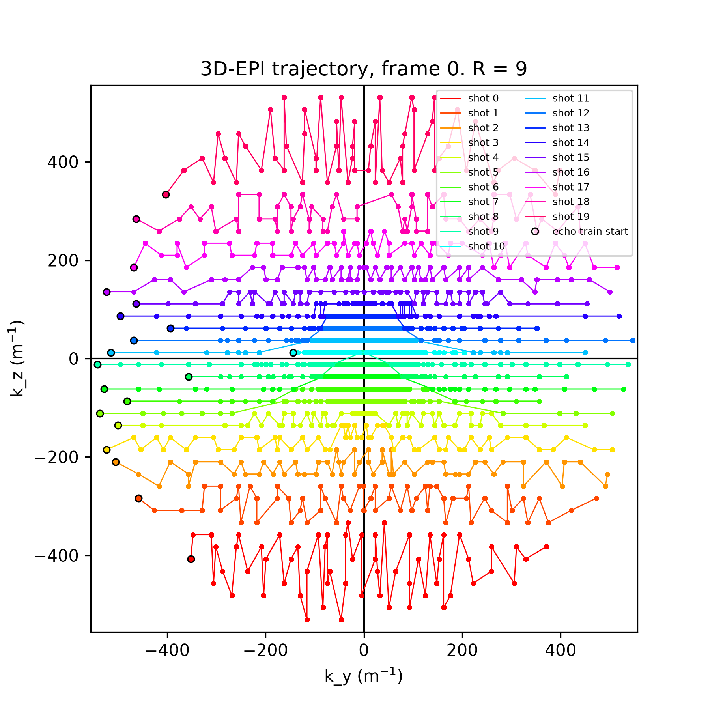
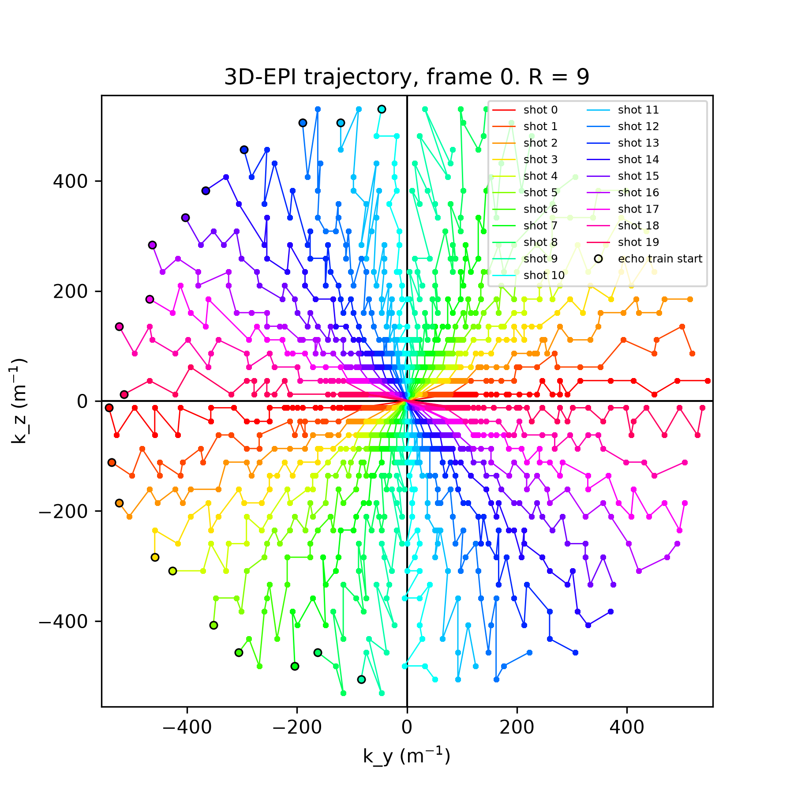
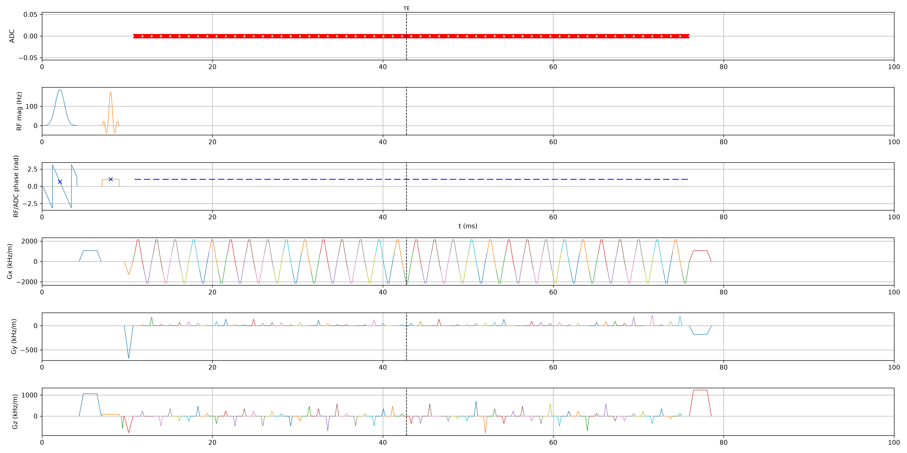
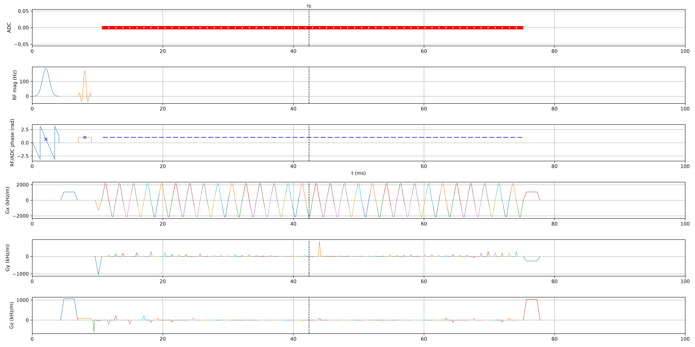

# ArbEPI-python: Python/pypulseq port of ArbEPI

Python port of [ArbEPI](../ArbEPI) (MATLAB/Pulseq), using [pypulseq](../pypulseq) as the Pulseq layer. Generates fast, vendor-agnostic 3D-EPI sequences from arbitrary 2D `(ky, kz)` sampling masks in the phase-encode-partition plane.

## Scope

This port covers Pulseq `.seq` sequence generation only. A few things from the original MATLAB repo are handled differently — see below.

- **GE `.pge` export**: `seq2ge/` is a pure-Python port of the PulCeq/pge2 toolchain (`seq2ceq`, `writeceq`, and the `pge2.pns`/`check_grad_acoustics` feasibility checks), and is the operative path for `seq2ge/ge_export.py`/`main.py --ge` — no MATLAB round trip, no sibling `../pulseq`/`../toppe`/`../PulCeq`/`../ArbEPI` checkouts required. Validated field-by-field and, for two of the four default sequences, byte-for-byte against real MATLAB output, including end to end through `main.py --ge` itself (see `seq2ge/`'s module docstrings and `CLAUDE.md`). See [GE export](#ge-export-pge) below.
- **Fat-sat RF pulse**: the MATLAB original designs this via GE's `toppe.utils.rf.makeslr` (min-phase SLR), which has no Python equivalent. This port uses pypulseq's built-in `make_gauss_pulse` instead — a simpler design with a less sharp spectral profile.
- **Plotting** (`plotting/plotting.py`) covers the sampling mask, k-space trajectory, point-spread-function, and single-TR pulse-diagram plots. The interactive scroll/slider mask viewer from the MATLAB repo is not ported. The single-TR plot (`plot_one_tr`) isn't a custom pulse-diagram renderer — it's a thin wrapper around pypulseq's own `Sequence.plot()`. Mask/PSF/trajectory plots take an optional `frame_idx` to select one frame out of a multi-frame run; see `plotting/plotting.py`'s module docstring for why the per-frame trajectory plot draws through exact-sliced ADC samples rather than the fine continuous line pypulseq's `calculate_kspace()` returns for the whole sequence. `plotting/plot_last_run.py` drives all of this against the most recent `output/` run (`python main.py --plot`, or standalone via `python -m plotting.plot_last_run`).
- **Poisson-disc sampling** (`sampling/pd_sample.py`) is a local reimplementation, not a dependency on [SigPy](https://github.com/mikgroup/sigpy) (whose `sigpy.mri.poisson` both `../ArbEPI/lib/pd_sample.m` and this module's algorithm are based on). SigPy was tried directly and rejected: its own `poisson()` has an unbounded `while slope_min < slope_max` binary-search loop with no iteration cap, which hangs forever on small/coarse grids where no achievable density slope lands within `tol` of the target acceleration (reproduced independently of any code in this repo — confirmed via `sigpy.mri.poisson` alone). Separately, both `../ArbEPI/lib/pd_sample.m` and this module's own first version had a *different* bug (not reseeding the point-placement RNG identically on every binary-search iteration, unlike real SigPy), which made the search non-convergent and slow rather than truly infinite. A third bug (a missing `nx*ny` active-list cap that real SigPy has) let the point-placement active list grow unboundedly in the same radius-floor/dense-center regime. `pd_sample.py`'s docstring has the full writeup of all three; the local implementation fixes all of them and adds a bounded outer-search iteration cap (`max_search_iters`) that SigPy itself lacks. The point-placement core is still JIT-compiled with [numba](https://numba.pydata.org/) -- a narrow, single-function dependency (unlike depending on the `sigpy` package wholesale) -- since even with all three fixes it's an inherently sequential loop that can run hundreds of thousands of iterations for worst-case seeds, and pure Python can't get there without JIT (measured ~1-12s/frame in pure Python vs. ~0.02-0.2s/frame JIT-compiled, at production scale).

## Requirements

Managed with [uv](https://docs.astral.sh/uv/):

```
uv sync --extra test
```

Depends on `pypulseq` (from PyPI), numpy, scipy, matplotlib, hdf5storage, and numba (see `pyproject.toml`; versions pinned in `uv.lock`).

## Getting started

1. Edit `params.py` (`load_params()`) to configure the experiment — scan geometry, timing, sampling method (`sampling_method`: `'caipi'`, `'ticaipi'`, `'pd'`, or `'rand'`), echo-train ordering (`epi_trajectory`: `'laminar'` or `'radial'`, see [Demo](#demo) below), and `seed` (an int for a reproducible sampling mask across runs, or `None` for a fresh one each time).
2. Run `main.py` to generate all four sequences:
   ```
   uv run python main.py
   ```
   Or step by step:
   ```python
   from params import load_params
   from sampling.gen_sampling_masks import gen_sampling_masks
   from sequences.ArbEPI import generate_arbepi
   from sequences.EPIcal import generate_epical
   from sequences.deGRE import generate_degre
   from sequences.noise import generate_noise

   params = load_params()
   omegas = gen_sampling_masks(params.R, params)
   generate_arbepi(omegas, params)   # writes output/ArbEPI.seq, output/samp_locs.mat
   generate_epical(params)           # writes output/EPIcal.seq, output/kxoe<Nx>.mat
   generate_degre(params)            # writes output/deGRE.seq (dual-echo, for coil sensitivity maps + B0 field map)
   generate_noise(params)            # writes output/noise.seq
   ```
   `generate_epical` and `generate_noise` must run after `generate_arbepi` — they load `output/samp_locs.mat`. All outputs go to `params.output_dir` (default `output/`, gitignored).
3. Add `--plot` to also write diagnostic plots (`mask.png`, `psf.png`, `trajectory.png`, `one_tr.png`) via `plotting/plot_last_run.py`, and/or `--ge` to also export each sequence to GE `.pge` (see [GE export](#ge-export-pge) below):
   ```
   uv run python main.py --plot --ge
   ```

There is no automated end-to-end pytest suite against MATLAB for `.seq` generation itself (no MATLAB install was available during that initial port — see `tests/` for unit tests on algorithm invariants instead, including an independent check that reads k-space back out of the assembled sequence and confirms it matches the sampling schedule). `sampling_method='caipi'` is deterministic (no RNG) and is the easiest configuration to sanity-check by hand. (The separate GE `.pge` export path below *was* validated against real MATLAB output, once a MATLAB install became available — see the GE export section and `CLAUDE.md`.)

## Demo

Diagnostic plots from a default-params run (`main.py --plot`; see `plotting/plot_last_run.py`), R = 9, `sampling_method='pd'`:

| | |
|---|---|
|  |  |
| 2D Poisson-disc `(ky, kz)` sampling mask, one frame | Point spread function for that mask |

`epi_trajectory` selects how `mask2epi_*` partitions that mask into each shot's echo train — `'laminar'` (ky non-decreasing rows) vs. `'radial'` (every shot a spoke through k-space center). Everything below is from the same `params.seed` (so the same sampling mask), one run per `epi_trajectory` value; `main.py --plot` always writes `trajectory.png`/`one_tr.png` for whichever setting was active, renamed here for side-by-side comparison:

| `epi_trajectory = 'laminar'` | `epi_trajectory = 'radial'` |
|---|---|
|  |  |

And the single-TR pulse diagram (`plot_one_tr`, a thin wrapper around pypulseq's own `Sequence.plot()`) for one shot under each ordering — note `radial`'s larger, single-echo Gy blip spike (~t=38ms) vs. `laminar`'s comparatively even blip sizes throughout the train:

| `epi_trajectory = 'laminar'` | `epi_trajectory = 'radial'` |
|---|---|
|  |  |

## Algorithms (`lib/mask2epi.py`)

`mask2epi_laminar`/`mask2epi_radial` turn a 2D `(ky, kz)` sampling mask (`Ny × Nz` booleans, `n` of them `True`) into `Nshots` EPI echo trains of `ETL` samples each (`Nshots * ETL == n`), i.e. a partition of the sampled points into `Nshots` groups plus, within each group, a visiting order — the sequence in which the readout gradient steps from one `(ky, kz)` sample to the next. This splits into two genuinely different sub-problems: **partitioning** (which shot does each point belong to) and **ordering** (the sequence within a shot). Partitioning is sampling-pattern design and differs completely between the two variants (below); ordering is a path-optimization problem shared by both, and is the more interesting half algorithmically.

### Why ordering is a *bottleneck* problem, not an ordinary shortest-path one

`lib/make_readout_grads.py` builds each shot's phase-encode "blip" gradients (the small pulses that step `k`-space between readout lines) as a single unit-amplitude waveform, scaled per step by that step's actual `(dky, dkz)`. Critically, the y- and z-blip *waveforms themselves* — their duration and peak amplitude — are each sized once, from the single **largest** step seen on that axis across the whole shot. So the quantity that determines whether a shot is achievable on real gradient hardware (and stays under peripheral nerve stimulation limits) is the worst individual step, not the total distance traveled. In graph terms: given the `ETL` sampled points as vertices of a complete weighted graph (edge weight = a physical step cost, defined below), we want an open Hamiltonian path minimizing the *maximum* edge weight, not the path with minimum *total* edge weight. The two objectives can disagree — a path that revisits a large gap several times can still beat, on the max-edge objective, a path that takes one enormous detour to avoid it once — and the max-edge version is the **bottleneck traveling salesman path problem** (a.k.a. the bottleneck Hamiltonian path / bottleneck wandering salesperson problem): NP-hard, and — because it isn't a sum of independent terms — not amenable to the usual shortest-path or sum-based TSP toolbox. (For metric edge weights, the best possible polynomial-time approximation ratio is 2; nothing better exists unless P = NP.)

The edge weight used throughout is a **physically weighted Chebyshev distance**:

```
weighted_step(dy, dz) = max(|dy| * Δky, |dz| * Δkz),   Δk = (1/FOVy, 1/FOVz)
```

not raw index distance `max(|dy|, |dz|)`. This repo's FOV is anisotropic (216 mm in y, 40.5 mm in z), so one index-step in `kz` corresponds to about 5× the physical gradient area of one index-step in `ky`; an unweighted metric would let the optimizer "save" index-distance by trading a cheap `ky` step for an expensive `kz` step, optimizing the wrong quantity entirely.

### Partitioning

- **`mask2epi_laminar`** (ported from the MATLAB original): sweeps `kz` columns outer, `ky` rows inner in *center-out* order (`_center_out`, an `fftshift`-based interleave: `0, N-1, 1, N-2, ...` roughly, so ky = 0 is spread across every shot rather than clustering all of it in shot 1), filling each shot to exactly `ETL` samples before starting the next. This guarantees `ky` is non-decreasing along the resulting echo train — a constraint inherited from the original design, not re-derived here.
- **`mask2epi_radial`** (this port's own addition): instead of rows, folds every point's angle about `(ky, kz) = (0, 0)` into `[0, π)` (`θ mod π`), so a point and its 180°-antipodal point land in the same bucket, then sorts by that folded angle and cuts the sorted list into `Nshots` contiguous chunks of exactly `ETL`. Each shot ends up an "opposite wedge pair" — a spoke through k-space center — rather than a raster row. This deliberately gives up `ky` non-decreasing, which is safe here because the Nyquist/odd-even ghost-correction reference scan (`sequences/EPIcal.py`) is keyed to readout-gradient polarity alternation, not to `ky` adjacency between consecutive echoes.

### Ordering: a three-pass optimization

Given a shot's point set (fixed by partitioning above), what visiting order minimizes the bottleneck objective? Three passes, each building on the last:

**Pass 1 — min-sum construction.** Minimizing the *bottleneck* directly from scratch is hard to search (accepting only strictly-max-improving moves creates huge plateaus — most candidate moves don't touch the current worst edge at all). So pass 1 first builds a tour minimizing ordinary *total* weighted length instead — a much better-behaved objective, since almost every candidate move changes it by a nonzero amount, giving local search something to descend on everywhere. This total-length tour also turns out to matter for its own sake, not just as a warm start: a path that's long in total tends to have many needlessly-large steps scattered throughout, most of which don't happen to be *the* worst step and so are invisible to a bottleneck-only search.
- Radial (an unconstrained 2D point-ordering problem): nearest-neighbor construction, refined by ordinary 2-opt (edge-swap local search on the *sum* objective) — `_sum_optimized_order`.
- Laminar is more constrained and admits an *exact* algorithm here rather than a heuristic: within one `ky` row, the set of consecutive-gap sizes along `kz` is the same regardless of which end you start from (reversing a sweep just reverses the order the same gaps are visited in), so the only real decision per row is which of its two ends connects to the *next* row's chosen entry point. That's a chain of binary decisions where each choice only interacts with its immediate neighbor — a textbook 2-state dynamic program (`_dp_row_directions`, state = "which end does this row exit from," O(number of rows), exact — not an approximation).

**Pass 2 — bottleneck refinement.** Starting from pass 1's tour (not from scratch), locally reduce the *worst* remaining step:
- Radial: best-improvement 2-opt (`_bottleneck_2opt_order`) where a move is accepted only if it strictly lowers the current maximum edge. A single segment-reversal move only ever changes two edges, so re-evaluating a candidate move in O(1) is possible by tracking just the top three largest edges beforehand (at most two can be removed by any one move, so the third-largest is always still present as a bound on "everything else"). This is also where a cheap **optimality certificate** appears: the bottleneck value of *any* Hamiltonian path can never beat the bottleneck value of the minimum bottleneck spanning tree over the same points (a Hamiltonian path is itself a spanning tree), and that lower bound is just Prim's algorithm's largest added edge (`_mst_bottleneck`). Whenever the achieved path matches that bound, it's provably globally optimal — despite the underlying problem being NP-hard in general.
- Laminar: since each row's decision is binary, pass 2 is a greedy hill-climb that flips one row's direction at a time, keeping the flip only if it strictly reduces the current worst inter-row link (`_hillclimb_row_directions_max`) — provably never worse than pass 1's tour alone, though (unlike the pass-1 DP) not guaranteed globally optimal, since it's a local search over a warm-started starting point rather than an exhaustive search of the 2^(rows) state space.

Radial additionally pins two things before searching, neither of which laminar needs (its row structure already fixes them implicitly): the sample nearest `(ky, kz) = (0, 0)` is fixed at echo index `(ETL - 1) // 2` — matching where `calc_te_tr_delays.py` places the nominal TE — and each half (before/after center) separately pins its own farthest-from-center point at the outer end, so the echo train visibly sweeps periphery → center → periphery like an actual radial spoke rather than an unconstrained tour that happens to wander near center at either end. Both passes 1 and 2 treat these as fixed endpoints of an open path and only reorder the interior.

**Pass 3 — crossing cleanup (radial only).** Passes 1-2 optimize the weighted-Chebyshev metric above, whose unit ball is a square rather than a smooth curve — it is *not strictly convex*. The classical argument that any self-crossing in a tour can always be "uncrossed" to strictly shorten it depends on strict convexity (the crossing quadrilateral's diagonals must be *strictly* longer than its sides); under a non-strictly-convex metric this can become an equality instead, so a crossing-removing move is a tie under the weighted metric and a strict-improvement-only search will never take it, even though nothing about the underlying hardware objective favors keeping the crossing. `_euclidean_uncross_refine` fixes this over the *whole* assembled shot (not each half independently — some crossings straddle the seam at the pinned center sample) in two stages, both capped so no edge may exceed the shot's already-achieved bottleneck value: first, 2-opt reversal and pairwise-exchange moves minimizing weighted *Euclidean* length instead (strictly convex, so the same uncrossing argument now goes through cleanly); second, for the rare residual crossing where even the fixing move is an exact tie in Euclidean length too (a swap across the pinned center position, where the two new edges are just a relabeling of the two removed ones), directly detect the geometric crossing and apply whichever available fixing move keeps every edge within the cap.

Full derivation, empirical results (bottleneck-only vs. two-pass vs. three-pass path length and crossing-count comparisons), and pointers to the brute-force-verified unit tests live in `lib/mask2epi.py`'s module and per-function docstrings.

## GE export (`.pge`)

Pure Python, no MATLAB install or sibling-repo checkouts required:

```python
from seq2ge.ge_export import export_to_ge
export_to_ge('output/ArbEPI.seq', 'output/ArbEPI', params)
```

`export_to_ge` runs a feasibility check (hardware limits, PNS, acoustic-resonance — see below) and raises `RuntimeError` if it fails, then writes the `.pge` via `seq2ge/seq2ceq.py` + `seq2ge/writeceq.py`. Verified end-to-end on a small test sequence and on a full-scale default-params run (`main.py`'s output): the resulting `.pge` files match freshly-regenerated real MATLAB output (`seq2ceq`/`pge2.writeceq`) byte-for-byte for two of the four default sequences and to within a single float32 ULP on a derived header field for the other two — see `CLAUDE.md` for the full record.

**Hardware limits are keyed off the `scanner` variable set in `params.py`** (`GE_MR750` or `GE_UHP`, see `scanners.py`): `load_params()` builds `params.spec` (a `ScannerSpec`) once and derives `sys.max_grad`/`sys.max_slew` for `.seq` generation from the same instance that `seq2ge/check.py`/`seq2ge/writeceq.py` read directly, so they can't drift out of sync with each other. `main.py --ge` also calls `seq2ge.ge_export.check_ge_feasibility()` on all four sequences — running the hardware/PNS/acoustics check without writing a `.pge` — *before* exporting any of them, so an infeasibility surfaces immediately instead of after several full exports. PNS is a physiological safety limit, not a hardware one — `PNSwt` (a separate `Params` field, not part of `ScannerSpec`, since it's phantom-vs-human scan context) defaults to the IEC 60601-2-33:2022-recommended `[0.8, 1.0, 0.7]`; `[0, 0, 0]` disables the PNS check entirely and is only appropriate for phantom/non-human scanning. Acoustic-resonance is checked but never blocks export — it's a `WARN` in the report, matching MATLAB's own `check_grad_acoustics.m`, which only ever calls `warning(...)`, never `error(...)`, when over threshold.

**`main.py --ge` now fails by default on three of the four sequences — this is a real finding, not a bug.** `PNSwt` was `[0, 0, 0]` for the entire lifetime of this port until now, so PNS was never actually evaluated in any `--ge` run to date (weight zero makes the per-channel contribution zero regardless of the real waveform). With the current default weights (validated against MATLAB's real per-instance pipeline to ~0.02 percentage points via `seq2ge/pns.py`/`matlab_reference/dump_pns_peak.m`), `EPIcal`/`ArbEPI`/`deGRE` all *exceed* MATLAB's own PNS throw threshold (>80% "exceeds normal mode", >100% "exceeds first controlled mode") at default params — see `CLAUDE.md` for the exact numbers. `seq2ge/check.py` matches MATLAB's throw condition exactly, so this now correctly blocks `main.py --ge` for these three sequences. This needs a resolution (lower slew rate or lengthen blip rise times) before scanning a human on these default sequences.

## Copy to scanner (`toppe/coppe.py`)

For internal UM fMRI lab use: `toppe/coppe.py` is a Python port of `../toppe/+toppe/+utils/coppe.m` that copies a folder of `.pge` files (e.g. `output/*.pge`) to a scanner over SSH, auto-allocating an unused `pge2` entry number for each and printing the resulting filename → entry-number mapping to enter on the scanner console.

```
uv run python toppe/coppe.py
```

See [`toppe/README.md`](toppe/README.md) for usage, SSH key setup, and troubleshooting.

## Architecture

Only entry points and tightly-coupled global config sit at the repo root — mirroring `../ArbEPI` having `params.m`/`main.m` directly at its repo root — everything else lives in a subpackage grouped by role:

```
params.py                   Params dataclass + load_params() (replaces params.m)
scanners.py                 ScannerSpec hardware profiles (GE_MR750, GE_UHP)
main.py                     Generate all 4 sequences, mirrors ArbEPI/main.m; --plot/--ge flags
sampling/                   Sampling mask generators (caipi, ticaipi, pd, rand)
lib/
  mask2epi.py                Core algorithm: partitions a 2D mask into EPI trajectories
                              (mask2epi_laminar / mask2epi_radial, selected by params.epi_trajectory)
  trap4ge.py                 GE-raster trapezoid rounding (from ../PulCeq)
  (RF/gradient helpers, TE/TR delay calculation)
sequences/                  ArbEPI, EPIcal, deGRE, noise sequence assembly
plotting/
  plotting.py                Diagnostic plots (mask/PSF/trajectory/single-TR)
  plot_last_run.py           Drives plotting.py against the most recent output/ run
seq2ge/                      Pure-Python GE .pge toolchain (Pulseq -> GE), wired into main.py --ge
  ge_export.py                 GE feasibility checking / .pge export entry points
  ceq.py                       Ceq/ParentBlock/Segment data contract
  blocks.py                    Block type/dynamics/comparison (port of PulCeq's compareblocks.m etc.)
  seq2ceq.py                   Pulseq Sequence -> Ceq (port of seq2ceq.m)
  writeceq.py                  Ceq -> binary .pge (port of writeceq.m)
  read_pge.py                  .pge binary reader, used only for validation
  pns.py                       PNS check (port of pge2.pns.m)
  acoustics.py                 Acoustic-resonance check (port of check_grad_acoustics.m)
  check.py                     Combines hardware/PNS/acoustics into one FeasibilityReport
  validate_against_matlab.py   Field-by-field / byte-for-byte comparison vs. MATLAB output
preprocessing/                Raw-data -> reconstructed-image pipeline, ported from ../epi-preprocessing
  config.py                    Session/per-sequence config (replaces config.m/set_seq_paths.m)
  raw_io.py                     ScanArchive reading via GE's Orchestra SDK (GERecon, external, not committed)
  coils.py                      Noise whitening + PCA coil compression (plain numpy, replaces BART)
  epi_gridding.py               1D NUFFT ramp-sample regridding (sigpy, replaces MIRT/hmriutils)
  oephase.py                    Odd/even EPI ghost-correction estimation + application
  smaps.py                      ESPIRiT sensitivity maps (sigpy, replaces BART) + mask/crop/resize/normalize
  cg_sense.py                   CG-SENSE solver
  recon_sigpy.py                Combined L1-wavelet + TV regularized SENSE (sigpy, replaces BART pics)
  matio.py                      Shared hdf5storage-compatible .mat reader (h5py-based)
  nifti_io.py                   Writes final recon images as NIfTI + JSON sidecar (for ITK-SNAP/FSLeyes/etc.)
  preprocess.py                 Stage 1 driver: raw data -> zero-filled k-space volume
  recon_frames.py               Stage 2 shared frame-loop + smaps loading
  run_preprocessing.py / run_cg_sense.py / run_rss.py / run_recon_sigpy.py   Batch entry points --
                                 CG-SENSE, RSS, and L1-wavelet+TV are wired up as sanity checks for
                                 validating Stage 1 output, not the final production reconstruction
                                 (that's a separate, more advanced Julia pipeline)
  calibrate_delay.py            Automated k-space center delay tuning
toppe/
  coppe.py                    Copy .pge files to the scanner over SSH, auto-allocating entry numbers
                              (port of ../toppe/+toppe/+utils/coppe.m; UM lab-internal use)
matlab_reference/            One-off scripts for re-validating seq2ge/ against a real MATLAB install
                              (not called by any Python code; MATLAB is not needed to use this repo)
  dump_ceq.m                 Dumps seq2ceq.m output for seq2ge/validate_against_matlab.py
  dump_pns_test.m            Dumps pge2.pns.m's synthetic sub_test() reference for seq2ge/validate_pns.py
  dump_pns_peak.m            Dumps peak PNS%% across every segment instance of a real sequence
  dump_acoustics_test.m      Dumps a check_grad_acoustics.m reference for seq2ge/acoustics.py's validation
  dump_acoustics_blockrange.m  Dumps the former MATLAB export path's exact acoustics blockRange check
tests/                       Unit tests (pytest)
docs/demo/                   Static images embedded in this README's Demo section
```

Index convention: internal computation is 0-based throughout (mask2epi's `schedule`, sampling masks, etc.). `output/samp_locs.mat` is written with `schedules` converted to 1-based (matching what MATLAB-side reconstruction code expects) — `parts` is already a 1-based shot label with 0 = unsampled, so it needs no conversion.

`.mat` files (`samp_locs.mat`, `kxoe<Nx>.mat`) are written via `hdf5storage` in MATLAB v7.3 format (HDF5-based), matching the original MATLAB code's `save(..., '-v7.3')`. `scipy.io.savemat`/`loadmat` cannot write or read v7.3 at all — use `hdf5storage.loadmat` (or `h5py` directly) to read these files from Python, not `scipy.io.loadmat`.

See [../ArbEPI/README.md](../ArbEPI/README.md) for background on the sampling methods and `mask2epi_laminar`'s original (MATLAB) partitioning design — see [Algorithms](#algorithms-libmask2epipy) above for the ordering optimization and `mask2epi_radial`, both this port's own addition with no MATLAB counterpart.

`preprocessing/` is a separate `pyproject.toml` optional-dependency group (`pip install -e ".[preprocessing]"`) with its own venv requirement (Python 3.10, since GE's Orchestra SDK is ABI-locked to it) — see `CLAUDE.md`'s `preprocessing/` section for the full detail: why BART/hmriutils/MIRT were dropped in favor of sigpy + plain numpy, why raw ScanArchive reading still needs GE's proprietary (non-pip, not committed) SDK, and what has/hasn't been validated against real data. The SDK itself is distributed as a GitHub release, accessible by request: [GEHC-External/MR-Orchestra-SDK-Python](https://github.com/GEHC-External/MR-Orchestra-SDK-Python/releases).

## References

Source repositories this port is derived from or ports code from:

- [rextlfung/ArbEPI](https://github.com/rextlfung/ArbEPI) — the MATLAB/Pulseq original this repo ports.
- [rextlfung/epi-preprocessing](https://github.com/rextlfung/epi-preprocessing) — the MATLAB original `preprocessing/` ports.
- [HarmonizedMRI/PulCeq](https://github.com/HarmonizedMRI/PulCeq) — `seq2ge/` ports `seq2ceq.m`/`writeceq.m`/`pge2.pns.m`/`check_grad_acoustics.m` from here.
- [HarmonizedMRI/B0shimming](https://github.com/HarmonizedMRI/B0shimming) — `sequences/deGRE.py` is adapted from this repo's `writeB0.m`.

Libraries this repo depends on:

- [pypulseq](https://github.com/imr-framework/pypulseq) — Pulseq sequence assembly (MIT).
- [SigPy](https://github.com/mikgroup/sigpy) — ESPIRiT sensitivity maps, NUFFT gridding, L1-wavelet/TV regularized reconstruction (BSD); `sampling/pd_sample.py` is also an independent reimplementation of `sigpy.mri.poisson`'s Poisson-disc algorithm (see that module's docstring for the bugs found in both it and the MATLAB original that motivated the reimplementation).
- [Numba](https://numba.pydata.org/) — JIT compilation for `pd_sample.py`'s point-placement core.
- [BART](https://mrirecon.github.io/bart/) — considered for coil compression/whitening/parallel imaging and explicitly dropped in favor of plain numpy + SigPy (see `CLAUDE.md`); noted here since several docstrings describe what this repo does *instead* of calling it.

Proprietary, not distributed with this repo:

- [GE Orchestra SDK / GERecon](https://github.com/GEHC-External/MR-Orchestra-SDK-Python) — required to read raw GE ScanArchive files in `preprocessing/raw_io.py`; installed separately by the user under GE's own license terms, not covered by this repo's license.

Algorithms and standards:

- ESPIRiT: Uecker M, Lai P, Murphy MJ, et al. "ESPIRiT — an eigenvalue approach to autocalibrating parallel MRI: where SENSE meets GRAPPA." *Magn Reson Med.* 2014;71(3):990-1001.
- Shinnar-Le Roux (SLR) pulse design: Pauly J, Le Roux P, Nishimura D, Macovski A. "Parameter relations for the Shinnar-Le Roux selective excitation pulse design algorithm." *IEEE Trans Med Imaging.* 1991;10(1):53-65. (Referenced in `lib/make_fatsat_rf.py` — the MATLAB original's `toppe.utils.rf.makeslr` implements this; this port uses pypulseq's `make_gauss_pulse` instead, see that module's docstring.)
- Golden-angle ordering: Winkelmann S, Schaeffter T, Koehler T, Eggers H, Doessel O. "An optimal radial profile order based on the Golden Ratio for time-resolved MRI." *IEEE Trans Med Imaging.* 2007;26(1):68-76. ([open-access copy](https://pmc.ncbi.nlm.nih.gov/articles/PMC9189059/); applied in `lib/mask2epi.py`'s `_golden_angle_shot_order`, see that function's docstring.)
- Peripheral nerve stimulation: IEC 60601-2-33:2022, the PNS prediction model `seq2ge/pns.py` implements (ported from PulCeq's `pge2.pns.m`).
